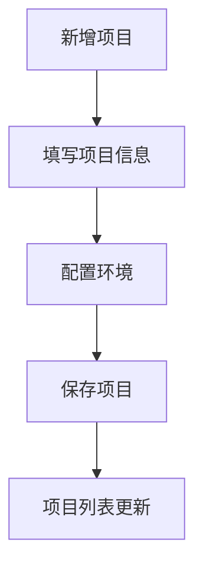
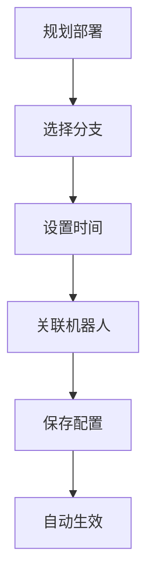
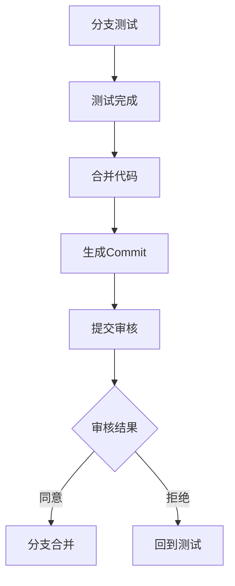

# 项目管理与分支部署系统 - 文档总览

## 📚 文档结构

本项目包含完整的业务需求、技术实现和接口规范文档，为系统的开发、部署和维护提供全面指导。

### 文档列表

| 文档名称 | 文件路径 | 说明 |
|---------|----------|------|
| 📋 **完整业务需求文档** | `完整业务需求文档.md` | 详细的业务需求和功能规范 |
| 🔧 **技术实现文档** | `技术实现文档.md` | 代码结构和技术实现细节 |
| 📊 **数据结构与接口文档** | `数据结构与接口文档.md` | 数据模型和接口定义 |
| 📝 **项目页面需求说明** | `项目页面-需求说明.md` | 项目模块专项需求 |
| ⏰ **定时发布需求** | `定时发布.md` | 分支部署和时间管理需求 |

## 🎯 系统概述

### 核心功能
- **项目管理**：项目创建、编辑、删除，多环境配置
- **分支部署**：智能分支管理，环境特定部署策略
- **测试流程**：完整的分支测试、合并、审核流程
- **Webhook集成**：机器人通知，自动化提醒
- **仓库管理**：分支列表，保护规则配置

### 技术栈
- **前端框架**：Next.js 15 + React 18
- **UI组件库**：Ant Design 5.x
- **开发语言**：TypeScript
- **数据存储**：LocalStorage (前端原型)
- **样式方案**：CSS Modules + CSS Variables

## 🏗️ 系统架构

### 目录结构
```
src/
├── app/                    # Next.js App Router
│   ├── layout.tsx         # 全局布局
│   ├── page.tsx           # 首页
│   ├── globals.css        # 全局样式
│   ├── projects/          # 项目管理路由
│   ├── commits/           # Commit管理路由
│   ├── webhooks/          # Webhook管理路由
│   └── repositories/      # 仓库管理路由
├── components/             # 业务组件
│   ├── projects/          # 项目相关组件
│   ├── repository/        # 仓库相关组件
│   └── webhooks/          # Webhook相关组件
└── omni.tsx               # 全局工具和类型
```

### 核心模块

#### 1. 项目管理模块
- **项目列表** (`/projects`)：项目概览、CRUD操作
- **项目详情** (`/projects/[name]`)：环境管理、分支规划

#### 2. 分支管理模块
- **状态管理**：testing → completed → merged
- **时间规划**：生效时间、失效时间
- **特殊分支**：dev (STG环境)、master (PROD环境)

#### 3. Commit管理模块
- **审核流程** (`/commits`)：同意、拒绝、查看
- **状态同步**：与分支状态联动

#### 4. Webhook模块
- **机器人管理** (`/webhooks`)：通知配置
- **集成支持**：分支关联、自动通知

## 📋 业务流程

### 1. 项目创建流程


### 2. 分支部署流程


### 3. 测试审核流程


## 🔧 技术特性

### 前端技术
- **组件化设计**：可复用的业务组件
- **类型安全**：完整的TypeScript类型定义
- **状态管理**：基于React Hooks的状态管理
- **数据持久化**：LocalStorage + StorageEvent同步
- **响应式设计**：适配不同屏幕尺寸

### 业务特性
- **智能分支管理**：自动状态转换、冲突检测
- **时间规划**：精确到分钟的时间控制
- **多环境支持**：STG、PROD环境隔离
- **审核机制**：完整的代码审核流程
- **通知集成**：Webhook机器人自动通知

## 📊 数据模型

### 核心实体
- **Project**：项目基础信息
- **Branch**：分支状态和时间信息
- **Commit**：代码合并记录
- **Robot**：Webhook通知机器人

### 状态管理
- **分支状态**：testing → active → completed → merged
- **Commit状态**：pending → approved/rejected
- **环境状态**：实时显示当前生效分支

## 🚀 快速开始

### 环境要求
- Node.js 18+
- npm 或 yarn

### 安装依赖
```bash
npm install
```

### 启动开发服务器
```bash
npm run dev
```

### 访问应用
- 开发环境：http://localhost:3000
- 项目列表：http://localhost:3000/projects
- Commit管理：http://localhost:3000/commits
- Webhook管理：http://localhost:3000/webhooks

## 📖 使用指南

### 1. 项目管理
1. 访问项目列表页面
2. 点击"新增项目"创建项目
3. 配置项目仓库和环境信息
4. 进入项目详情进行分支管理

### 2. 分支规划
1. 在项目详情页点击"规划部署"
2. 选择分支和设置生效时间
3. 关联通知机器人
4. 保存配置等待自动生效

### 3. 特殊分支部署
1. 点击"部署dev"或"部署master"
2. 查看已合并分支列表
3. 确认部署操作
4. 分支自动生效

### 4. 代码审核
1. 分支测试完成后点击"合并代码"
2. 系统生成Commit记录
3. 在Commit列表进行审核
4. 审核结果自动同步到分支状态

## 🔍 故障排除

### 常见问题

#### 1. 数据丢失
- **原因**：LocalStorage被清空
- **解决**：系统会自动初始化默认数据

#### 2. 分支状态异常
- **原因**：并发操作导致状态不一致
- **解决**：刷新页面重新加载数据

#### 3. 时间显示错误
- **原因**：时区设置问题
- **解决**：检查系统时区设置

### 调试工具
- 浏览器开发者工具
- LocalStorage查看器
- Console日志输出

## 📈 性能优化

### 已实现优化
- **组件懒加载**：按需加载页面组件
- **数据缓存**：LocalStorage持久化
- **防抖处理**：用户输入防抖
- **表格虚拟化**：大数据量表格优化

### 建议优化
- **服务端渲染**：提升首屏加载速度
- **CDN部署**：静态资源加速
- **数据分页**：减少单次数据加载量

## 🔐 安全考虑

### 数据安全
- 前端数据存储在LocalStorage
- 敏感信息不在前端存储
- Webhook URL验证

### 操作安全
- 关键操作二次确认
- 状态变更日志记录
- 错误操作可回退

## 📝 更新日志

### v1.0.0 (2025-01-15)
- ✨ 完整的项目管理功能
- ✨ 分支生命周期管理
- ✨ Commit审核流程
- ✨ Webhook通知集成
- ✨ 响应式UI设计

## 🤝 贡献指南

### 开发规范
- 使用TypeScript开发
- 遵循ESLint规则
- 组件命名使用PascalCase
- 函数命名使用camelCase

### 提交规范
- feat: 新功能
- fix: 错误修复
- docs: 文档更新
- style: 代码格式调整
- refactor: 代码重构

## 📞 支持与反馈

### 技术支持
- 查看技术实现文档获取详细信息
- 检查数据结构文档了解接口规范
- 参考业务需求文档理解功能逻辑

### 问题反馈
- 功能建议：提交Feature Request
- Bug报告：提交Bug Report
- 文档问题：提交Documentation Issue

---

## 📚 相关文档链接

- [完整业务需求文档](./完整业务需求文档.md) - 详细的功能需求和业务规则
- [技术实现文档](./技术实现文档.md) - 代码结构和实现细节
- [数据结构与接口文档](./数据结构与接口文档.md) - 数据模型和API规范
- [项目页面需求说明](./项目页面-需求说明.md) - 项目模块专项需求
- [定时发布需求](./定时发布.md) - 分支部署时间管理需求

---

*最后更新：2025年1月15日*